# COVid (CoronaVirus Indonesia) App

Aplikasi COVid adalah sebuah aplikasi mobile untuk data corona virus di Indonesia, ini dibuat untuk keperluan Challange 3 di SMKCoding Online 2020

1. Kotlin Language 
2. Firebase Database 
3. Android Studio 
4. Room ktx

    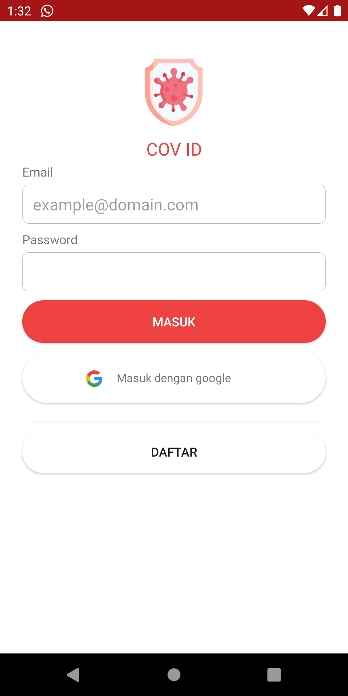
    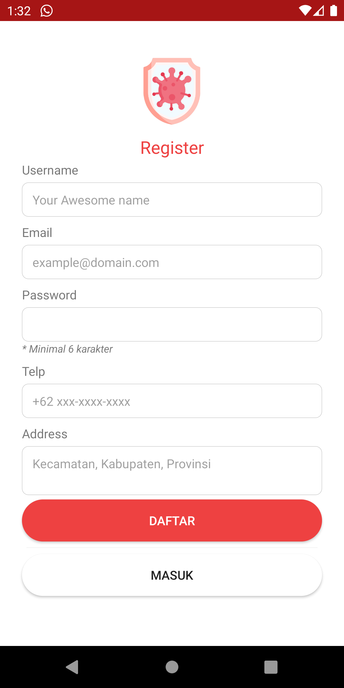
    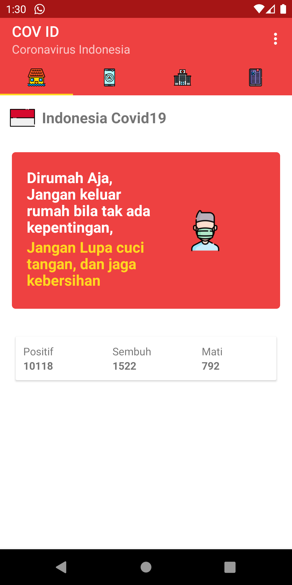
    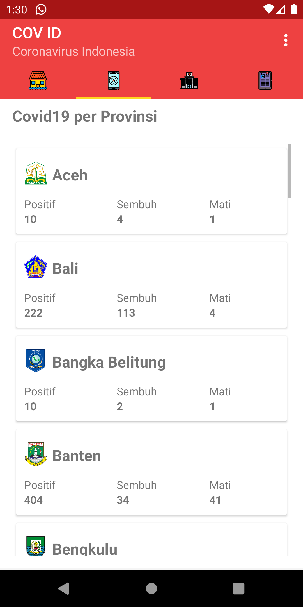
    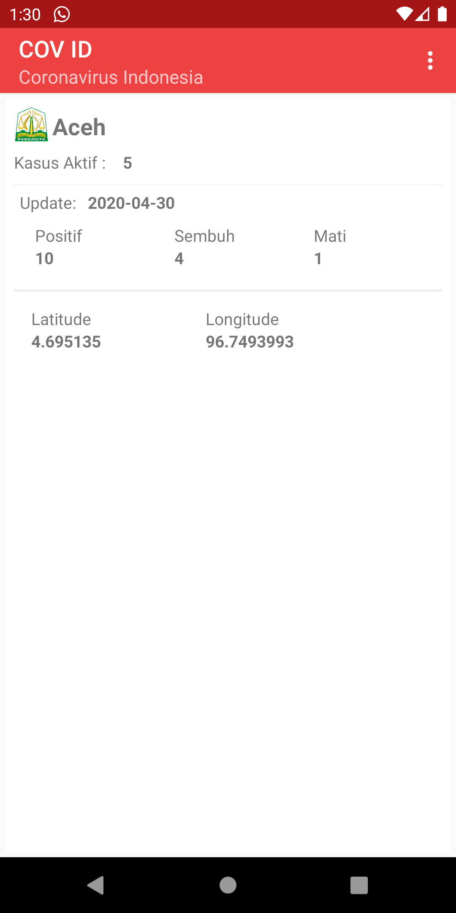
    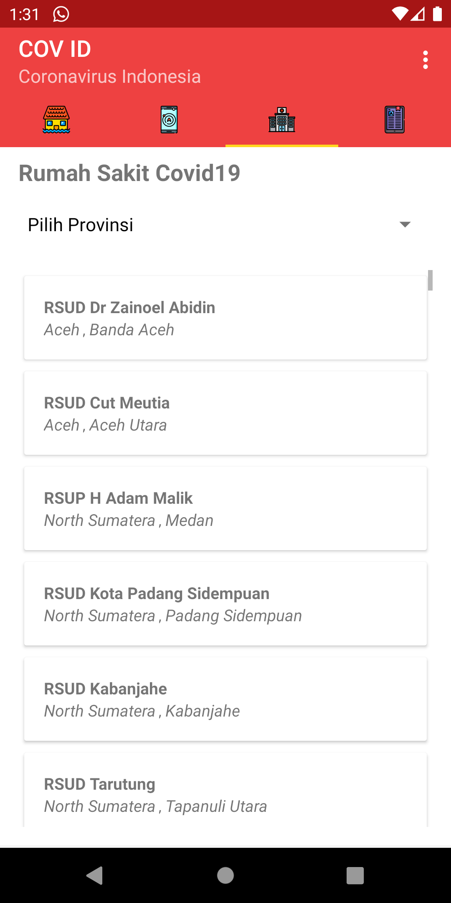
    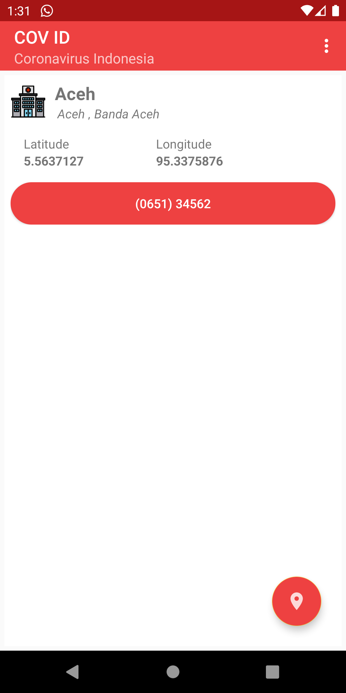
    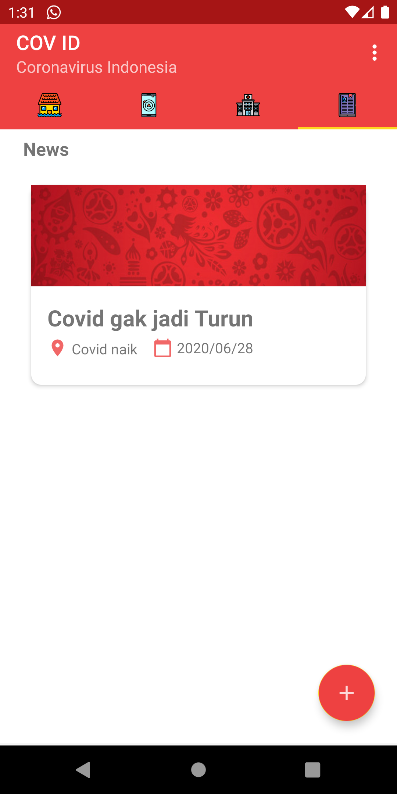
    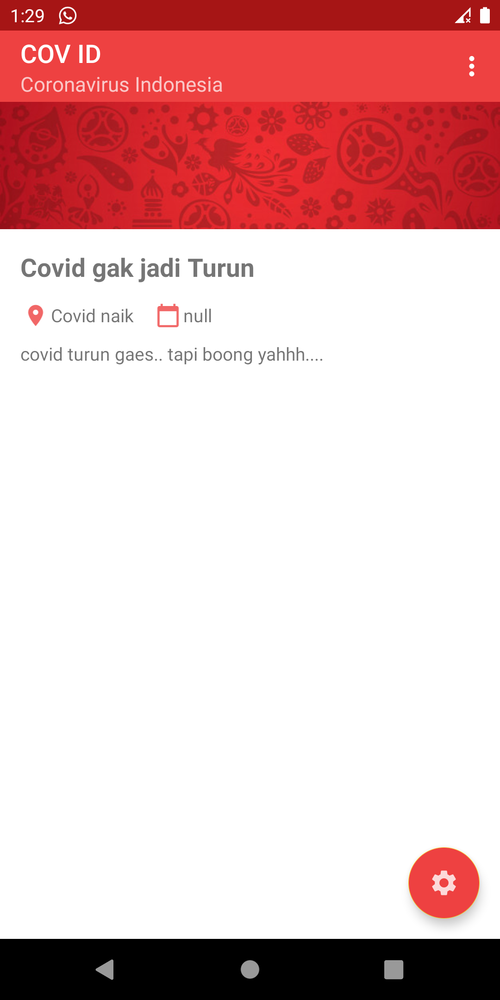
    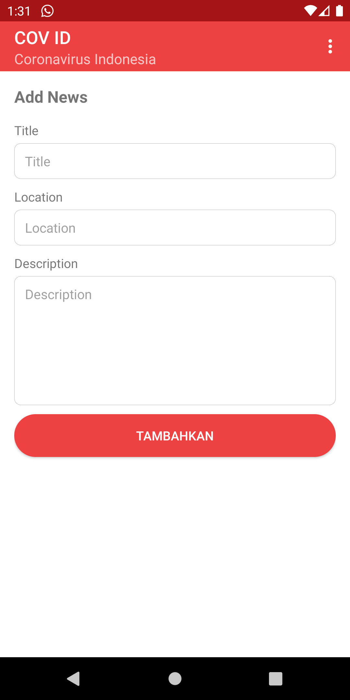
    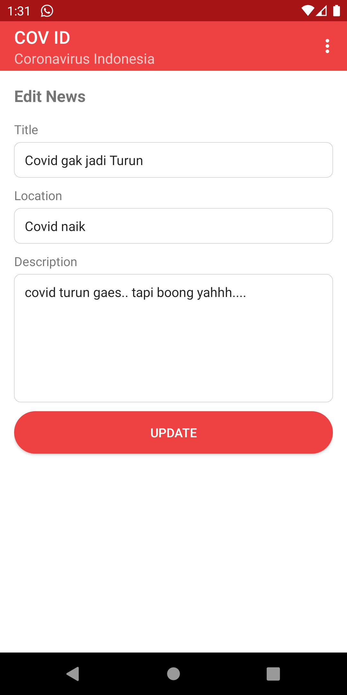
    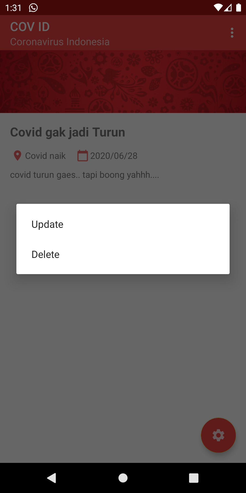
    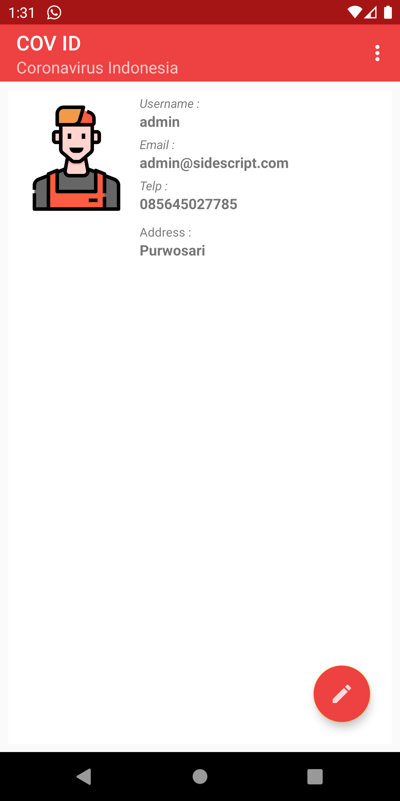
    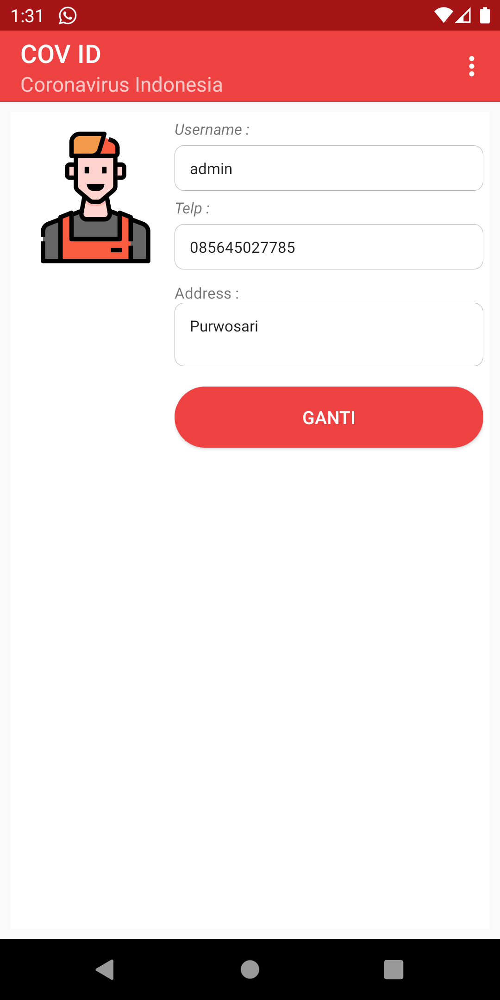

    
Link Download

    <a href="https://drive.google.com/drive/folders/146XQmbqeei-VwOka7BzS2auGYCkVQqlJ?usp=sharing" style="border: none; padding: 15px 50px 15px 50px; border-radius: 5px; background-color: white; box-shadow: 0px .125rem .5rem rgba(0,0,0,0.2)">
     Download in drive</a>

